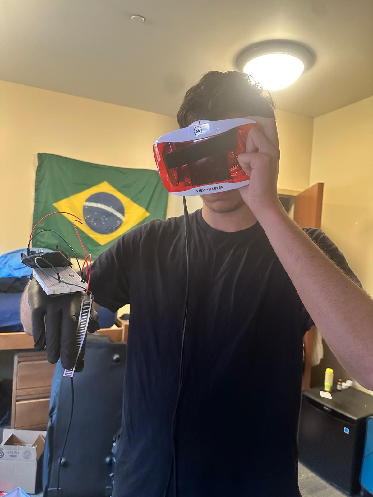

# Euler: Location-Anchored VR Environments via Beacon-Based Localization

Euler is a Unity VR system that anchors virtual content to real-world geographic coordinates. It uses GPS for outdoor environments and Bluetooth trilateration via ESP32 beacons for indoor positioning. Head orientation is tracked with an IMU connected to a glove or headset, enabling spatially-aware, hands-free interaction.



## Features

- Indoor localization using 3+ ESP32 Bluetooth beacons
- GPS-based outdoor geolocation fallback
- Real-time VR rendering in Unity with anchored virtual content
- A* pathfinding between geo-anchored nodes
- Visual and text-based navigation instructions (e.g., turn left/right)
- IMU-based glove interaction for triggering or placing objects

## Project Structure

```
Euler/
├── UnityProject/                 # Unity VR environment
│   ├── Assets/
│   ├── Scenes/
│   └── Scripts/
├── raspberry_pi_localization/   # Python code for beacon triangulation
│   ├── main.py
│   ├── trilateration.py
│   ├── rssi_utils.py
│   ├── beacon_config.py
│   └── gps_converter.py
├── arduino_glove/               # Arduino code for IMU + pressure sensor glove
│   └── glove_reader.ino
├── images/
│   ├── utilization_demo.png
│   └── gps_beacon_setup.png
└── README.md
```

## Setup Instructions

### Hardware Required

- 3x ESP32 (beacons)
- 1x Raspberry Pi (localization hub)
- 1x Teensy or Arduino (for IMU + pressure sensor glove)
- VR-capable Unity device (standalone or tethered)

### Beacon Localization

1. Place 3 ESP32 devices at fixed, measured positions
2. Flash them to continuously advertise via BLE
3. On the Raspberry Pi, run the localization script:

```bash
cd raspberry_pi_localization
python3 main.py
```

This script:
- Scans for RSSI values from each beacon
- Estimates distances from RSSI
- Applies trilateration to compute user location
- Optionally converts to latitude/longitude


### Unity Integration

1. Open `UnityProject` in Unity Hub
2. Assign your player object and `nodeMarkerPrefab` in the scene
3. Run the demo scene with `SimulationSettings.useSimulatedGPS = true` to test
4. For real tracking:
   - Connect serial data from Pi or Arduino
   - Use `GPSReader` or a custom socket reader to update player location

### Glove Setup

1. Connect MPU6050 (or MPU9250) to Arduino or Teensy
2. Optionally add pressure sensors on fingers
3. Upload `glove_reader.ino` from `arduino_glove/`
4. Send rotation/gesture data to Unity over serial

## License

MIT License